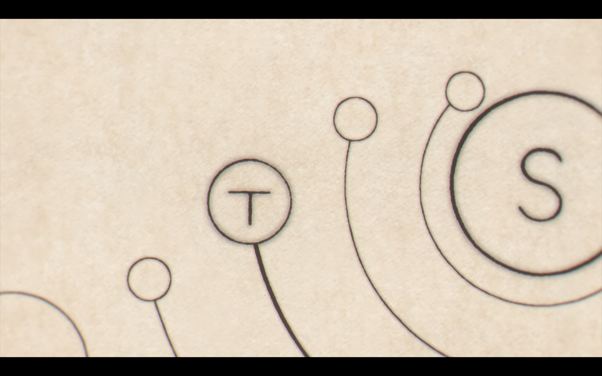
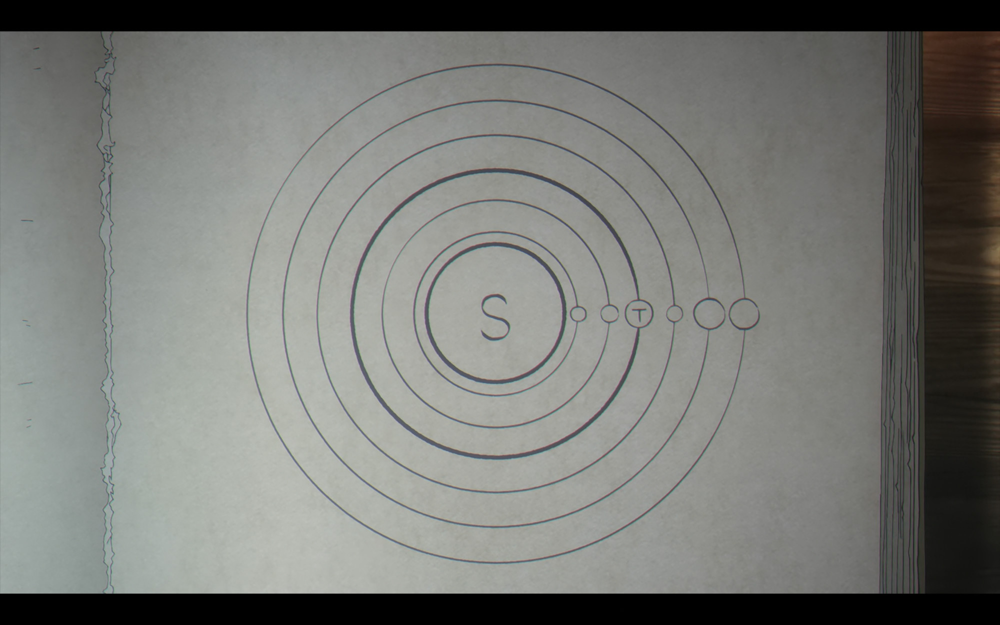

# Orb

A small visualization of how people used to picture the solar system, and how that picture flipped.

It's three plain HTML files drawn with Canvas. No frameworks, no build, no dependencies. Black ink on a white background and some slowly moving circles.

**[Open the live visualization](index.html)**

## Why I made this

I watched _Orb: On the Movement of the Earth_ (チ。―地球の運動について―) and wanted to actually see the idea it's about, not just read about it. The show follows people who risk their lives over one forbidden belief: that the Earth moves around the Sun instead of sitting still at the center of everything.

The opening song, "Kaiju" (怪獣) by Sakanaction, just won Song of the Year at MUSIC AWARDS JAPAN 2026, so this felt like a good time to build it.

The seed for the whole thing is one scene early on, where Rafal sketches the heavens by candlelight and dares to put the Sun in the middle.

He builds it out one ring at a time, marking the Sun with an `S` and the Earth with a `T`, until the finished page shows the Earth as just one more circle going around the Sun.

I kept his `S` and `T` labels in this project, so the moving version reads the same way his drawing does.

For most of history the accepted view was geocentric. Earth in the middle, everything else circling around it. The problem is the planets don't cooperate. They slow down, stop, and even loop backwards in the sky. To keep Earth at the center, astronomers kept adding circles on top of circles (epicycles riding on deferents) until the whole thing looked like a tangled clock.

The heliocentric view just put the Sun in the middle. The loops disappeared. The same motions you see at night come out of plain, simple circles, and Earth turns out to be one more planet going around.

This little project lets you watch that switch happen.

## What's inside

`index.html` is the main one. It plays the geocentric model, then smoothly morphs every planet into its heliocentric position, then back again. Same sky, two different centers. There are play, pause, and reset buttons.

`geocentric.html` shows the old Ptolemaic model on its own. Earth (`T`) is fixed in the center and every planet rides a little circle on a bigger circle, slowly tracing those looping petal shapes.

`heliocentric.html` shows the Copernican model. The Sun (`S`) sits in the center and everything, Earth (`T`) included, draws a clean circle.

Let any of them run for a bit. The orbits draw themselves and leave trails behind, so the full pattern shows up over time.

One honest note: the sizes, distances, and speeds are stylized to look good and read clearly, not to be astronomically correct.

---

> "10% of profits should be given to Potocki."
